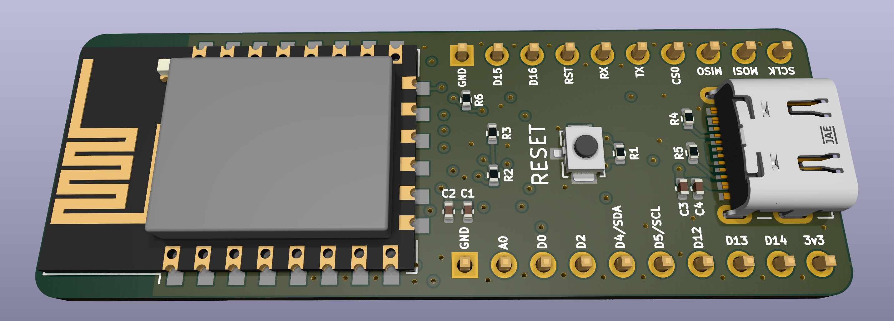

# CURIO

CURIO is an ESP8266 based dev board!

This repo is the KiCAD project for the board.

## Features

* USB-C
* ESP-12E/F WiFi module
* Compatible with Arduino
* Breadboard friendly
* Voltage divider for the `ADC0` pin

## More info

A more detailed writeup on the development of this board can be found at 
<https://willwarren.com/2023/05/09/curio-an-esp-12f-based-dev-board/>!

## License

This repo is licensed under Creative Commons Attribution-ShareAlike 4.0 
International.

Read the full license here: [LICENSE.txt](LICENSE.txt)
